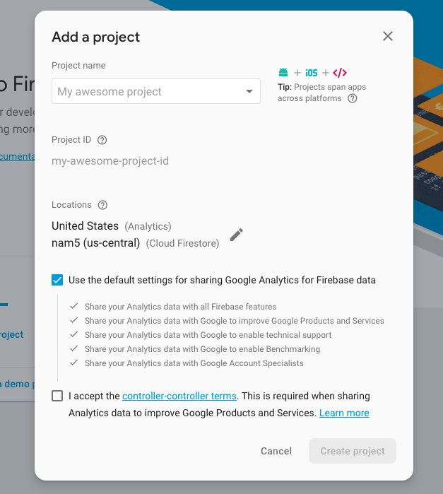
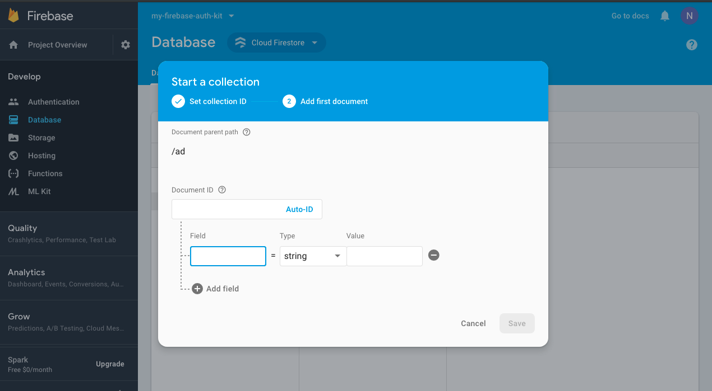

## Firebase Auth Kit

<!--  -->

A simple Auth Kit demonstrating almost all of the social and custom auth methods powered by Firebase.

https://firebase.google.com/

## New to Firebase?

Check out the docs here : https://firebase.google.com/docs/

## Firebase Hosting

https://firebase.google.com/products/hosting/

## Firebase Authentication

https://firebase.google.com/products/auth/

## Firebase Cloud Firestore

https://firebase.google.com/products/firestore/

## Setup Firebase Hosting

1. Create a new project.
   

2. Fill in the details.
   

3. Enable Hosting.

## Setup Firebase Cloud Firestore

1. Enable Cloud Firestore.

2. Add a new collection and schema to cloud firestore.
   

## Deploy a React App to Firebase using Firebase Hosting

### `npm i firebase-tools -g`

Install firebase-tools globally.

### `npm i firebase`

Add firebase to your react app.

### `firebase login`

Login to firebase CLI.

### `firebase init`

Initialize firebase app. This will open up an interface : select hosting, directory build, all routes should go to index.html.

### `npm run build`

Will create a production build by creating a build folder which will consist of an index.html file which is the minified production build of the app (that's why we selected the directory as build in the previous step and all routes will go through index.html).

### `firebase deploy`

Deploy the production build to Firebase.

## Available Scripts

In the project directory, you can run:

### `npm run dev`

Runs the app in the development mode. 
Open [http://localhost:3000](http://localhost:3000) to view it in the browser.

### `npm run build`

Creates a production build.

### `npm start`

Serves a production build.
